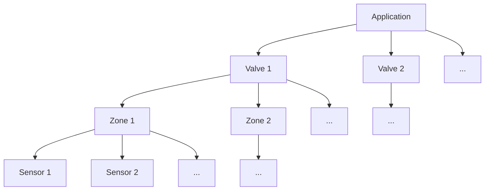

# Automatic Web-based Plant Watering System

**WaterIO** is a small private project to enable automatic watering of plants based on soil humidity. 

## Schematic

The application is structured as the diagram shows. The MCU (microcontroller unit) can handle different valves connected via a relay module. Each valve can consist of one or multiple watering zones and each zone can consist of one or multiple soil humidity sensors.

